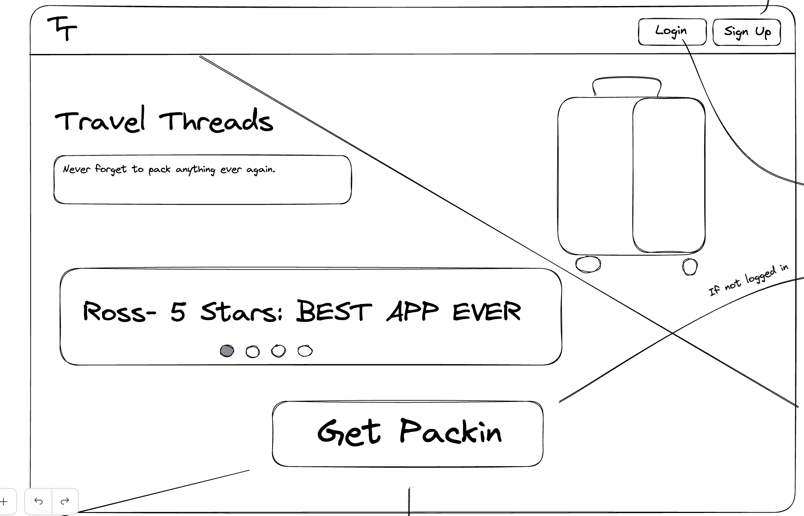
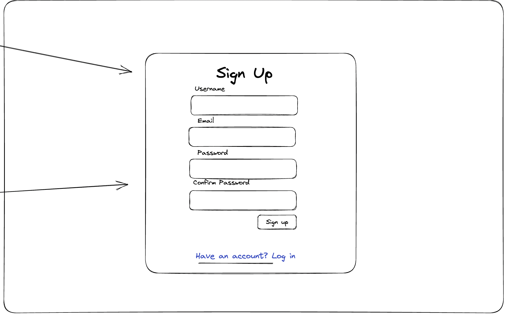
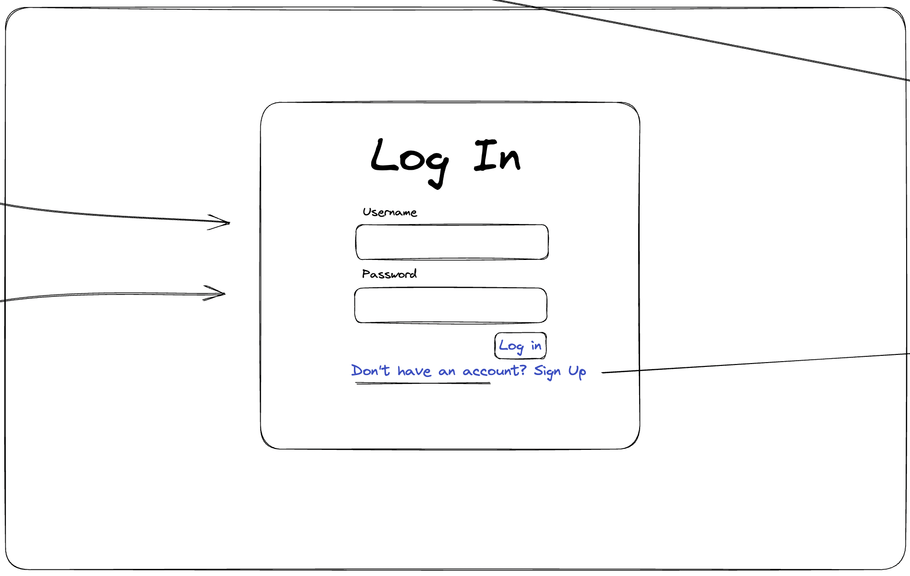
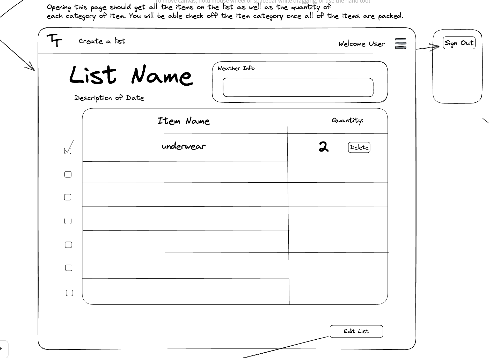

# User Graphical Human Interface

---

## Main Page

---

This is the first page users get to when they go to the website. There will be navbars with dropdown menu on the top of the page to allow users signup for an account, and login after they create an account. After signing up for an account, users can also navigate to the get packin button to create a packing list.

## Main Page Sign up

This page is a Modal that will pop up on the main page when users click on sign up from the navbar dopdown menu.

## Main Page Login

This page is a Modal that pops up on the main page when users click on Log in from the navbar dopdown menu.

## Packing Lists page

On this page, users with existing packing lists can view their lists, edit existing lists delete the list, and add a new packing list. New users can click on Add a packing list to create a new packing list.

## Create List Page

On this page, users can create a packing list. They can add the name of the list, the location of their trip(country, state, city), and the start and end date of teh trip.

## Packing Lists Page

This page shows the details of a specific packing list. Weather information for the duration of the trip is displayed on the top right, the trip name is displayed on the top left with a message including the trip destination. users can also view the items in the packing list, check items off depending on if they're packed or not, and edit the list. 

- table of item name,quantity, and a check fundtion that allows users to check off itmes that are packed.
- weather data is displayed at the top right of the page (Weather API integration)
- edit button to a datelist detail page.
- Users can check off items depending if tehy're packed or not
- contains a short message with the trip destination

## Date List Detail Page

This page contains the details of each day of the trip.

- The name of the trip is on the top of the page. Users can click of the name and be redirected to the packing list page 
- The date of the trip and weather information of that particular day with the weather information(Weather API Integration)
- an edit button which redirects users to a page where they can update the name, quantity and packing status of the items in their packing list.
- a delete button that deletes the item
- an add item button that allows users add an item to their list.

