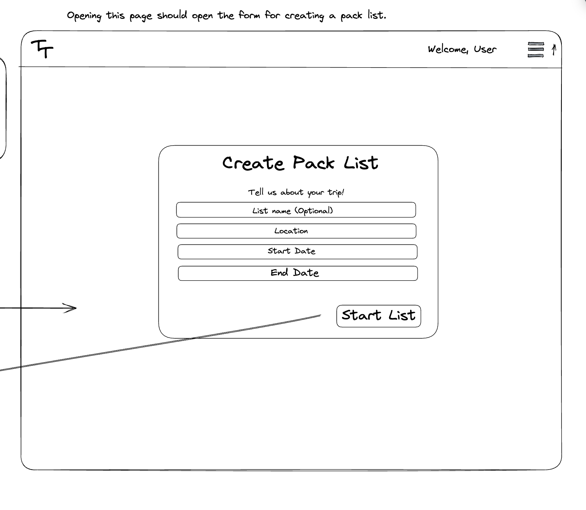
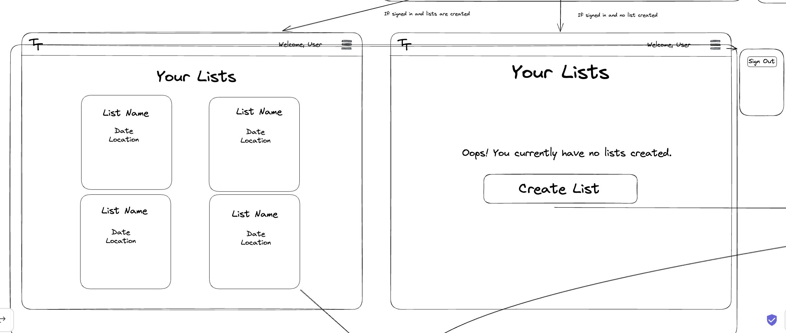
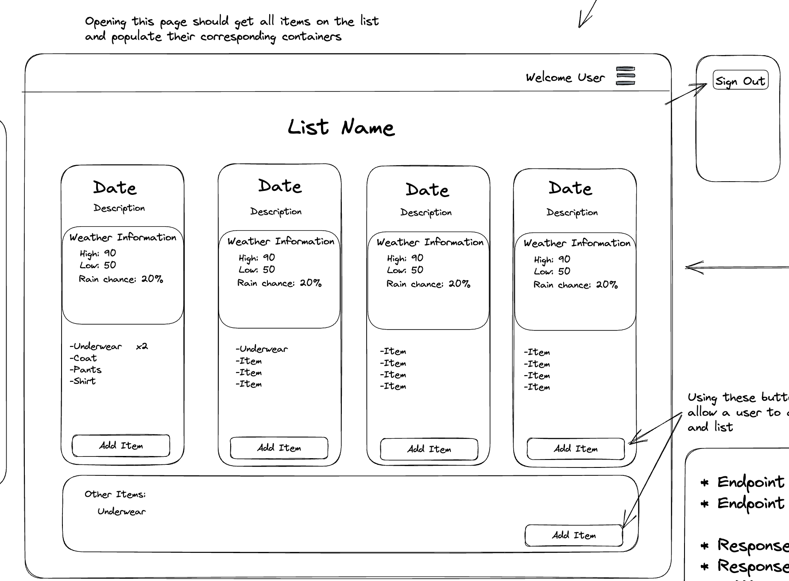

# User Graphical Human Interface

## Home Page

This is the main web page of our application shown in the web browser when users first open our application. There is a navbar with a dropdown menu on the top of the page with navlinks to the signup and login page. Users can signup for an account, and login after creating an account. As a logged in user, you can also navigate to the get packin button to create a packing list.

## Main Page Sign up

This page is a Modal that pops up on the main page when users click on sign up from the navbar dopdown menu. users can also navigate to this form page through the signup link on the login page.

## Main Page Login

This page is a Modal that pops up on the main page when users click on login from the navbar dopdown menu. Users can also navigate to this form page when they click the get packin button if they're not already logged in.

## Packing Lists page

After a user is logged in, they are redirected to the packing lists page. On this page, users with existing packing lists can view their lists, edit existing lists, delete a list, and add a new packing list. New users can click on the add a packing list button to create a new packing list.

## Create List Page

On this page, users can create a packing list. They can add the name of the list, the location of their trip(country, state, city), and the start and end date of the trip.

## Packing List Page

This page shows the details of a specific packing list. Weather information for the duration of the trip is displayed on the top right, the trip name is displayed on the top left with a message including the trip destination. users can also view the items in the packing list, check items off depending on if they're packed or not, and edit the list. 

- Table conatining a list of items with the item name, quantity, and a checkbox that allows users to select itmes that are packed.
- Weather data is displayed at the top right of the page (Weather API integration)
- Edit button to a datelist detail page.
- Contains a short message with the trip destination(Location API integration)

## Date List Detail Page

This page contains the details of each day of the trip.

- The name of the trip is on the top of the page. Users can click on the name of the packing list, and this takes them to the packing list page 
- The date of the trip and weather information of that particular day with the weather information(Weather API Integration)
- An edit button which redirects users to a page where they can update the name, quantity and packing status of the items in their packing list.
- A delete button that deletes the item
- An add item button that allows users add an item to their list.

